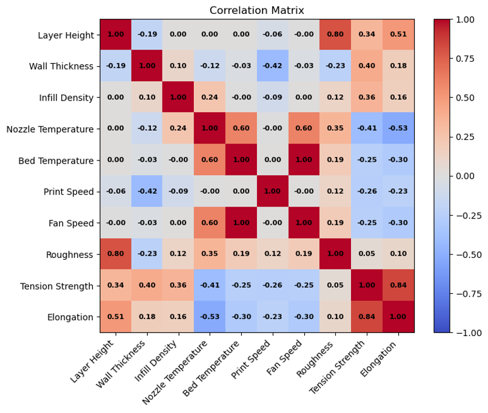

# 3D Print Insight

This project delivers an end-to-end predictive framework for fused deposition modeling (FDM) 3D-printed part roughness, tension strength, and elongation using a hill climbing ensemble. By tuning convex weights on out-of-fold predictions from linear regression, random forest, and XGBoost models, the ensemble outperforms any single model. This demonstrates a practical approach for blending diverse learners to minimize error.

Dataset available [here](https://www.kaggle.com/datasets/afumetto/3dprinter?select=data.csv)

***

# Motivation

By predicting performance before printing, we can be equipped with "what-if" insights before a single print runs. Inverting those models then enables automatic selection of settings to hit target performance, cutting down on trial-and-error, material waste, and overall time-to-market.

***

# Exploratory Data Analysis Conclusions

  

Overall, our three targets exhibit distinct distributional shapes. Both **surface roughness and elongation** are **positively skewed**, while **tensile strength** is **essentially symmetric**, indicating different underlying process variability. The two key categorical factors **material** (PLA vs. ABS) and **infill pattern** (grid vs. honeycomb), are **evenly represented**, simplifying comparisons. Correlation analysis shows that roughness is driven most strongly by **layer height (r &approx; +0.80)**, tensile strength by **wall thickness (r &approx; +0.40)**, and elongation again by **layer height (r &approx; +0.51)**, with the **thermal settings (nozzle, bed, fan) largely redundant**. Finally, **PLA yields markedly better performance than ABS** (&approx;25 % smoother, 29 % stronger, 45 % more ductile), and **honeycomb infill** provides modest additional gains over grid.

***

# Predictive Modeling Conclusions

  
  

This study compared two evaluation strategies for a hill-climbing (level-2) regression ensemble built from three base (level-1) learners - 1) **linear regression**, 2) **Random Forest**, and 3) **XGBoost**.  

  The first strategy was a single-level CV stacking. It was built using 5-fold CV to generate out-of-fold (OOF) predictions and train the ensemble. Then, the same OOF rows were used for the evaluation metric (either RMSE or MAE). The ensemble had an RMSE of 0.436 compared to 0.487 - 0.497 for the single models. This improvement, however, reflects **mild data leakage**: the ensemble’s weight search had already *seen* the noise pattern in those OOF rows, so the resulting metric is inherently optimistic.  

  Replacing the initial setup with a 5x4 nested CV strategy eliminated the leakage by assigning every observation to an outer test fold that remained untouched until the very end for the tradeoff of increased computational requirements. Within this nested CV strategy, the ensemble still performs the best, recording an RMSE of 0.465 compared to the 0.487 - 0.497 for the individual models.

  The first scenario did have an RMSE lower than the second strategy. This was expected, as the first scenario was inherently optimistic and exhibited data leakage. The findings of this study are two-fold: first, stacking has genuine predictive power as long as the base models are diverse. Second, the magnitude of the benefits of stacking are sensitive to evaluation leakage - nested CV (or a comparable hold-out strategy) should be considered whenever ensemble weights are tuned on the same data used for performance reporting. Additional work could look to stabilize the stack by exploring weight regularization/Bayesian averaging, expanding the library of base models, fine-tuning the hyperparameters of the base models, and ideally validating the ensemble on a truly external data set.

***
